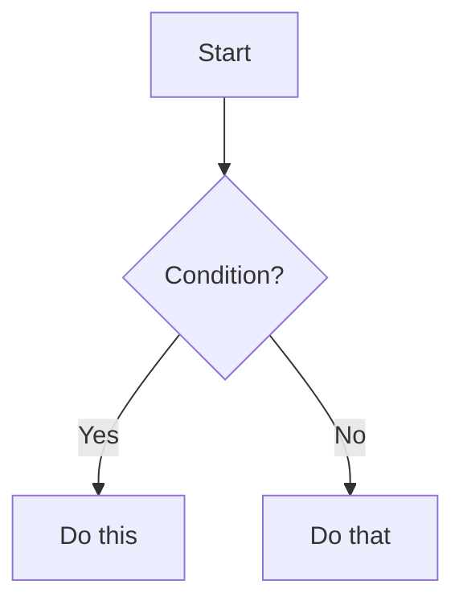

# ◈ Altair K–12 Curriculum

An open-source, Markdown-driven static site generator for computer science education across all grade levels. Add a Markdown file to `content/` and a fully styled, navigable HTML lesson page is automatically generated and deployed.

[](https://github.com/Altair-Linux/Altair-Curriculum/actions/workflows/deploy.yml)

---

## Table of Contents

- [How It Works](#how-it-works)
- [Quickstart](#quickstart)
- [Project Structure](#project-structure)
- [Writing Lessons](#writing-lessons)
- [Front-Matter Reference](#front-matter-reference)
- [Interactive Elements](#interactive-elements)
- [Adding Projects and Exercises](#adding-projects-and-exercises)
- [Running Locally](#running-locally)
- [Deployment](#deployment)
- [Validation](#validation)
- [Contributing](#contributing)
- [Licence](#licence)

---

## How It Works

```
content/**/*.md  →  scripts/generate.js  →  dist/**/*.html
                                         →  dist/nav.json
                                         →  dist/search-index.json
```

`scripts/generate.js` walks the entire `content/` tree, parses each Markdown file's YAML front-matter and body, renders it through `templates/lesson.html` via Handlebars, and writes the result to a mirrored path inside `dist/`. It also emits `nav.json` (the full navigation tree) and `search-index.json` (the client-side search corpus). All three outputs are consumed at runtime by the JavaScript in `assets/js/`.

Pushing to `main` triggers the GitHub Actions workflow in `.github/workflows/deploy.yml`, which builds the site and deploys `dist/` to GitHub Pages automatically.

---

## Quickstart

```bash
git clone https://github.com/Altair-Linux/Altair-Curriculum.git
cd Altair-Curriculum
npm install
npm run dev
```

Open [http://localhost:3000](http://localhost:3000). Any change to `content/`, `templates/`, or `assets/` automatically rebuilds and reloads the browser.

---

## Project Structure

```
altair-k12/
├── content/                  Markdown lessons organised by grade band
│   ├── k-2/
│   ├── 3-5/
│   ├── 6-8/
│   ├── 9-12/
│   ├── projects/
│   └── exercises/
├── templates/
│   └── lesson.html           Handlebars template for all pages
├── assets/
│   ├── css/
│   │   ├── main.css          Design system, layout, dark mode, search
│   │   └── lesson.css        Article typography, code blocks, gamification
│   └── js/
│       ├── nav.js            Sidebar tree, theme toggle, mobile nav
│       ├── search.js         Full-text search modal
│       ├── lesson.js         TOC, reading progress, copy buttons, hints
│       └── gamification.js   XP, levels, badges, streaks
├── scripts/
│   ├── generate.js           Core static site generator
│   ├── serve.js              Local dev server with live reload
│   └── validate.js           Validation suite (9 check groups)
├── public/                   Files copied verbatim to dist/ (favicon, robots.txt)
├── dist/                     Generated output — do not edit by hand
├── .github/
│   └── workflows/
│       └── deploy.yml        CI/CD pipeline
├── .markdownlint.json        Markdown lint rules
└── package.json
```

---

## Writing Lessons

### 1. Create a Markdown file

Place it anywhere under `content/`. The folder path becomes the URL:

```
content/6-8/intro-to-python.md  →  /6-8/intro-to-python.html
content/projects/my-project.md  →  /projects/my-project.html
```

### 2. Add front-matter

Every file must begin with a YAML front-matter block:

```markdown
---
title: My Lesson Title
grade: 7
tags: [python, loops, beginner]
difficulty: beginner
estimated-time: 45 minutes
prerequisites: [Introduction to Python]
type: lesson
---

Your lesson content starts here.
```

### 3. Write content

Use standard Markdown. The generator supports GitHub Flavoured Markdown (GFM) including tables, task lists, and fenced code blocks.

### 4. Rebuild

```bash
npm run build
```

Or leave `npm run dev` running — it rebuilds and reloads automatically.

---

## Front-Matter Reference

| Field | Required | Type | Description |
|-------|----------|------|-------------|
| `title` | ✅ | string | Page title shown in the header and navigation |
| `grade` | recommended | K–12 or number | Grade level (use `K` for Kindergarten) |
| `tags` | recommended | array | Keywords for search and filtering |
| `difficulty` | recommended | string | One of `beginner`, `intermediate`, `advanced`, `expert` |
| `estimated-time` | recommended | string | Freeform, e.g. `45 minutes`, `2 hours` |
| `prerequisites` | optional | array | Titles of lessons students should complete first |
| `type` | optional | string | One of `lesson`, `project`, `exercise`, `quiz`. Defaults to `lesson` |

---

## Interactive Elements

These HTML patterns are supported inside Markdown files and styled automatically.

### Collapsible Sections

```html
<details class="collapsible">
<summary>Section title</summary>
<div class="details-body">

Content here — can include Markdown, code blocks, lists.

</div>
</details>
```

### Hint Chains

```html
<div class="hint-chain">
  <div class="hint-item">
    <button class="hint-trigger" aria-expanded="false">💡 Question?</button>
    <div class="hint-body">Answer revealed on click.</div>
  </div>
  <div class="hint-item">
    <button class="hint-trigger" aria-expanded="false">💡 Follow-up?</button>
    <div class="hint-body">Second answer.</div>
  </div>
</div>
```

### Mermaid Diagrams

Use a fenced code block with `mermaid` as the language identifier:

````markdown

````

Diagrams automatically switch between light and dark Mermaid themes when the user toggles the site theme.

### Callout Blocks

```html
<div class="callout callout-note">
  <span class="callout-icon" aria-hidden="true">ℹ</span>
  <div class="callout-body">
    <div class="callout-title">Note</div>
    Your note content here.
  </div>
</div>
```

Available variants: `callout-note`, `callout-tip`, `callout-warning`, `callout-danger`.

---

## Adding Projects and Exercises

Projects live in `content/projects/` and use `type: project` in their front-matter. Exercises live in `content/exercises/` and use `type: exercise`.

The gamification system awards different XP amounts per type:

| Type | XP awarded on completion |
|------|--------------------------|
| `lesson` | 50 XP |
| `exercise` | 30 XP |
| `project` | 100 XP |

The engine infers type from both the front-matter `type` field and the URL path. Front-matter takes precedence.

---

## Running Locally

### Development mode (recommended)

```bash
npm run dev
```

Starts the generator, watches for file changes, and serves the site at `http://localhost:3000` with live reload. No external tools required.

### Build only

```bash
npm run build
```

Generates `dist/` from the current `content/`, `templates/`, and `assets/`.

### Custom port

```bash
PORT=8080 npm run dev
```

### Serve a pre-built dist/

```bash
npm run serve
```

---

## Deployment

### GitHub Pages (default)

1. Go to your repository **Settings → Pages**
2. Set **Source** to **GitHub Actions**
3. Set **Actions → General → Workflow permissions** to **Read and write**
4. Push any change to `main` — the workflow deploys automatically

The live URL will be `https://<your-org>.github.io/<repo-name>/`.

### Netlify

1. Connect your repository to Netlify
2. Set **Build command** to `npm run build`
3. Set **Publish directory** to `dist`
4. Leave **Base directory** blank

Netlify detects pushes to `main` and deploys automatically. Pull request previews are created for every PR.

### Manual deployment

```bash
npm run build
```

Upload the contents of `dist/` to any static hosting provider (S3, Cloudflare Pages, Vercel, etc.).

---

## Validation

Run the full validation suite against `dist/` after building:

```bash
npm run build && npm run validate
```

The validator checks:

1. `dist/` exists and is populated
2. Required files present: `index.html`, `nav.json`, `search-index.json`, all CSS/JS assets
3. `nav.json` integrity — every URL resolves to an HTML file on disk
4. `search-index.json` — all nav URLs indexed, no missing titles
5. HTML structure — required markers, `<title>`, `lang`, skip-link, ARIA labels
6. Markdown front-matter — required and recommended fields, grade range, difficulty enum
7. `nav.json` ↔ `content/` count consistency (detects stale builds)
8. Asset path resolution — all local `href`/`src` references resolve
9. Repository hygiene — no `.git` or `node_modules` inside `dist/`

Exit code `0` = all checks passed. Exit code `1` = one or more failures (CI fails the build).

---

## Contributing

Contributions of new lessons, bug fixes, design improvements, and translations are welcome.

### Adding a lesson

1. Fork the repository and create a branch: `git checkout -b lesson/grade-8-recursion`
2. Create your Markdown file in the appropriate `content/` subdirectory
3. Include all recommended front-matter fields
4. Run `npm run build && npm run validate` — fix any failures before opening a PR
5. Open a pull request — the CI pipeline will build the site and post a page count summary as a comment

### Content guidelines

- Write for the stated grade level — use vocabulary and examples appropriate to that age group
- Each lesson should focus on one concept
- Always include a "Check Your Understanding" section with at least two hint-chain items
- Code examples must be complete and runnable — no `...` or implied code
- Use Mermaid diagrams to visualise algorithms, data flow, and program structure
- Collapsible sections are for optional depth, not essential content — the lesson must be complete without them
- Avoid linking to content behind a login wall or paywall

### Code and template changes

- Run `npm run validate` after any change to `scripts/generate.js` or `templates/lesson.html`
- CSS changes must be verified at mobile (375px), tablet (768px), and desktop (1280px) widths
- JavaScript changes must not introduce new global variables beyond the established `window.__*` pattern
- All interactive elements must remain keyboard-navigable and work without JavaScript (graceful degradation)

### Commit message format

```
type(scope): short description

feat(content): add Grade 8 recursion lesson
fix(nav): correct active state on nested pages
style(css): improve dark mode contrast on code blocks
docs(readme): update deployment instructions
```

### Branch naming

```
lesson/<slug>        New lesson content
fix/<issue-number>   Bug fix
feat/<slug>          New feature or component
docs/<slug>          Documentation only
```

---
## Licence

This project is licensed under **Altair Education License for Schools (AELS) v1.0** and **Zorvia** — you may use, modify, and redistribute the code under their terms.
