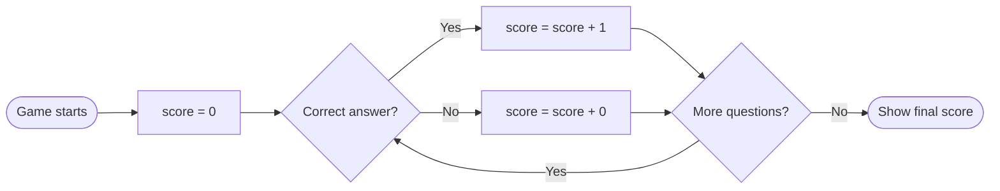

A **variable** is a named container that stores a value your program can use and change. Think of it as a labelled box — you can put something in the box, check what is inside, and swap it out for something different.

## Why Programs Need Variables

Imagine a quiz game. The program needs to remember the player's score as they answer questions. Without a variable, the moment you earn a point the program would forget it immediately.



The box labelled `score` gets updated every time the player answers correctly. At the end, the program reads the same box to show the result.

## Creating a Variable in Scratch

In Scratch, variables live in the **Variables** category (the orange blocks).

**Step 1 — Make the variable:**

1. Click **Variables** in the block palette
2. Click **Make a Variable**
3. Name it `score`
4. Leave **For all sprites** selected
5. Click **OK**

You will now see an orange `score` reporter block and a checkbox to show it on the stage.

**Step 2 — Set the starting value:**

```
when 🏴 clicked
set [score] to [0]
```

This resets score to zero every time the game starts. Without this, Scratch remembers the value from the last run — which is almost never what you want.

**Step 3 — Change the value:**

```
when this sprite clicked
change [score] by [1]
```

Every click adds 1 to whatever is currently stored in `score`.

<details class="collapsible">
<summary>Why "set" and "change" are different</summary>
<div class="details-body">

`set [score] to [10]` — puts the value 10 into the box, erasing whatever was there before.

`change [score] by [1]` — reads what is already in the box, adds 1, and puts the result back.

If `score` is currently 7:
- `set score to 10` → score is now **10**
- `change score by 1` → score is now **8**

Use `set` to initialise or hard-reset. Use `change` to update incrementally.

</div>
</details>

## Three Types of Values

Variables in Scratch can hold three kinds of values.

| Type | Example | Used for |
|------|---------|----------|
| Number | `42`, `3.14`, `-5` | Scores, positions, timers |
| Text (string) | `"Hello"`, `"Player 1"` | Names, messages, answers |
| Boolean | `true`, `false` | Flags, on/off switches |

<details class="collapsible">
<summary>Scratch project: Name greeter</summary>
<div class="details-body">

Build this in Scratch:

```
when 🏴 clicked
ask [What is your name?] and wait
set [playerName] to (answer)
say (join [Hello, ] (playerName)) for (2) seconds
```

What is happening:
1. `ask` pauses the program and stores whatever the user types into a special variable called `answer`
2. `set [playerName] to (answer)` copies that into our own variable
3. `join` combines two pieces of text into one string
4. `say` displays the result in a speech bubble

Try extending it — ask for their favourite colour and use it in the greeting.

</div>
</details>

## Variables Inside Loops

Variables become most powerful when they change inside a loop.

```
when 🏴 clicked
set [counter] to [1]
repeat [10]
    say (counter) for (0.5) seconds
    change [counter] by [1]
```

This counts from 1 to 10, saying each number for half a second. The loop runs 10 times, and `counter` increments on every iteration.

<details class="collapsible">
<summary>Challenge: Countdown timer</summary>
<div class="details-body">

Modify the loop above to count **down** from 10 to 1 and then say "Blast off!".

Hints:
- Start `counter` at `10`
- Use `change [counter] by [-1]` (negative one)
- After the loop ends, add a `say [Blast off!]` block

```
set [counter] to [10]
repeat [10]
    say (counter) for (1) second
    change [counter] by [-1]
say [Blast off! 🚀] for (2) seconds
```

</div>
</details>

## Check Your Understanding

<div class="hint-chain">
  <div class="hint-item">
    <button class="hint-trigger" aria-expanded="false">💡 What is a variable?</button>
    <div class="hint-body">A named container that stores a value. The program can read the value, change it, or replace it at any time.</div>
  </div>
  <div class="hint-item">
    <button class="hint-trigger" aria-expanded="false">💡 What is the difference between "set" and "change"?</button>
    <div class="hint-body">"Set" replaces the stored value completely. "Change" adds to (or subtracts from) the existing value. Use "set" to initialise, "change" to update.</div>
  </div>
  <div class="hint-item">
    <button class="hint-trigger" aria-expanded="false">💡 If score = 5 and you run "change score by 3", what is score now?</button>
    <div class="hint-body">8. The program reads 5, adds 3, and stores 8 back into the score variable.</div>
  </div>
  <div class="hint-item">
    <button class="hint-trigger" aria-expanded="false">💡 Why should you always "set" a variable at the start of a program?</button>
    <div class="hint-body">Scratch (and most languages) remember variable values between runs. Without a reset, your program starts with leftover data from the last time it ran, causing unpredictable behaviour.</div>
  </div>
</div>

## Going Further

- Build a simple clicker game: click a sprite to increase `score`, display it on screen, and show a congratulations message when it reaches 20
- Add a `lives` variable that decreases when the player makes a wrong answer
- Explore Scratch's **List** blocks — a list is like a variable that holds many values at once
