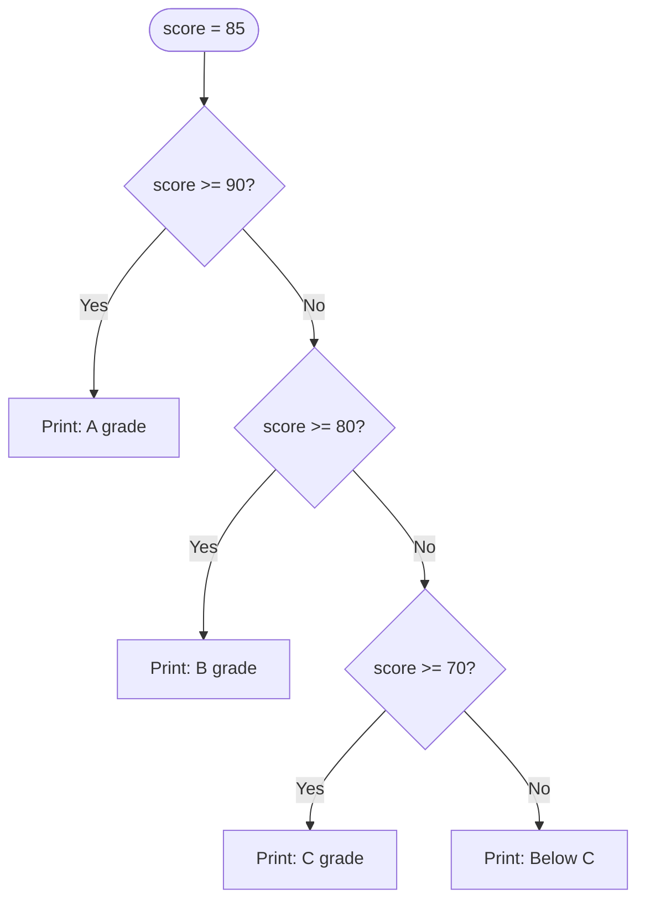

Python is one of the most widely used programming languages in the world. It powers everything from web servers and data science tools to NASA mission software and YouTube's recommendation engine. It was designed to read almost like plain English, which makes it an excellent first text-based language.

## Your First Python Program

```python
print("Hello, World!")
```

`print()` is a **function** — a named block of code that does a specific job. You call it by writing its name followed by parentheses. Whatever you place between the parentheses gets displayed in the terminal.

## Variables and Data Types

Python variables are created the moment you assign a value. There is no separate declaration step.

```python
name = "Aisha"
age = 13
height = 1.62
is_student = True
```

Python automatically detects the **type** based on the value you assign.

| Type | Python name | Example |
|------|-------------|---------|
| Whole number | `int` | `42`, `-7`, `0` |
| Decimal number | `float` | `3.14`, `-0.5` |
| Text | `str` | `"hello"`, `'world'` |
| True/False | `bool` | `True`, `False` |

You can check a value's type with the built-in `type()` function:

```python
print(type(42))        
print(type("hello"))   
print(type(3.14))      
print(type(True))      
```

<details class="collapsible">
<summary>String operations worth knowing</summary>
<div class="details-body">

Strings support a set of useful operations out of the box:

```python
greeting = "hello"

print(greeting.upper())          
print(greeting.capitalize())     
print(len(greeting))             
print(greeting.replace("hello", "goodbye"))  

first = "Aisha"
last  = "Malik"
full  = first + " " + last       
print(full)                      

age = 13
message = f"I am {age} years old."
print(message)
```

The `f"..."` syntax is called an **f-string**. It lets you embed variable values directly inside a string using `{}`.

</div>
</details>

## Conditionals

Python uses `if`, `elif`, and `else` to make decisions. Indentation (4 spaces) defines what belongs inside each block — Python uses whitespace instead of curly braces.

```python
score = 85

if score >= 90:
    print("A grade")
elif score >= 80:
    print("B grade")
elif score >= 70:
    print("C grade")
else:
    print("Below C — keep practising!")
```



Python checks conditions from top to bottom and stops at the first one that is `True`. Only one branch runs per execution.

## Loops

### The `for` Loop

A `for` loop iterates over a sequence — a range of numbers, a list, or the characters in a string.

```python
for i in range(5):
    print(i)
```

`range(5)` produces the sequence `0, 1, 2, 3, 4`. Notice it starts at 0 and stops *before* 5. This is called **zero-based indexing** and appears throughout programming.

```python
for i in range(1, 11):
    print(i)
```

`range(1, 11)` starts at 1 and stops before 11, producing 1 through 10.

### The `while` Loop

A `while` loop keeps running as long as its condition stays `True`.

```python
lives = 3
while lives > 0:
    print(f"Lives remaining: {lives}")
    lives -= 1
print("Game over!")
```

<details class="collapsible">
<summary>Danger: infinite loops</summary>
<div class="details-body">

If the condition of a `while` loop never becomes `False`, it runs forever and freezes your program.

```python
x = 1
while x > 0:
    print(x)
    x += 1
```

`x` starts positive and keeps growing — it never becomes 0 or less, so this loop never ends. Always make sure something inside the loop eventually makes the condition `False`. Press `Ctrl+C` in the terminal to kill a runaway program.

</div>
</details>

## Functions

A function is a reusable block of code you give a name. You define it once and call it as many times as you need.

```python
def greet(name):
    message = f"Hello, {name}! Welcome to Python."
    print(message)

greet("Aisha")
greet("Marcus")
greet("Lin")
```

Functions can also **return** a value back to the caller:

```python
def add(a, b):
    return a + b

result = add(3, 7)
print(result)
```

`return` sends a value back. After `return` executes, the function exits immediately.

<details class="collapsible">
<summary>Functions with default arguments</summary>
<div class="details-body">

You can give a parameter a default value. If the caller does not provide that argument, the default is used.

```python
def greet(name, language="English"):
    if language == "Spanish":
        print(f"Hola, {name}!")
    elif language == "French":
        print(f"Bonjour, {name}!")
    else:
        print(f"Hello, {name}!")

greet("Aisha")               
greet("Carlos", "Spanish")   
greet("Marie", "French")     
```

Default arguments must always come *after* non-default arguments in the function signature.

</div>
</details>

## Putting It Together: Grade Calculator

```python
def letter_grade(score):
    if score >= 90:
        return "A"
    elif score >= 80:
        return "B"
    elif score >= 70:
        return "C"
    elif score >= 60:
        return "D"
    else:
        return "F"

def average(scores):
    return sum(scores) / len(scores)

student_scores = [88, 92, 75, 60, 95]
mean = average(student_scores)
grade = letter_grade(mean)

print(f"Average score : {mean:.1f}")
print(f"Letter grade  : {grade}")
```

`{mean:.1f}` in the f-string formats the float to one decimal place.

## Check Your Understanding

<div class="hint-chain">
  <div class="hint-item">
    <button class="hint-trigger" aria-expanded="false">💡 What are the four basic data types in Python?</button>
    <div class="hint-body">int (whole numbers), float (decimals), str (text), and bool (True/False).</div>
  </div>
  <div class="hint-item">
    <button class="hint-trigger" aria-expanded="false">💡 What does range(2, 8) produce?</button>
    <div class="hint-body">The sequence 2, 3, 4, 5, 6, 7 — it starts at 2 and stops before 8.</div>
  </div>
  <div class="hint-item">
    <button class="hint-trigger" aria-expanded="false">💡 What is the difference between a for loop and a while loop?</button>
    <div class="hint-body">A for loop iterates over a known sequence a fixed number of times. A while loop runs as long as a condition is True — you use it when you do not know in advance how many iterations you need.</div>
  </div>
  <div class="hint-item">
    <button class="hint-trigger" aria-expanded="false">💡 What does return do inside a function?</button>
    <div class="hint-body">It sends a value back to whoever called the function and immediately exits the function. Without return, a function returns None by default.</div>
  </div>
  <div class="hint-item">
    <button class="hint-trigger" aria-expanded="false">💡 Why is indentation important in Python?</button>
    <div class="hint-body">Python uses indentation to define code blocks instead of curly braces. Incorrect indentation causes an IndentationError or silently puts code outside the block you intended, causing logic bugs.</div>
  </div>
</div>

## Going Further

- Install Python from [python.org](https://www.python.org) and run these examples in your terminal
- Rewrite your Scratch clicker game from Grade 4 in Python using `input()` and a `while` loop
- Explore the `random` module: `import random` then `random.randint(1, 10)` to build a guessing game
- Read about **lists** — Python's equivalent of Scratch's List blocks — in the next lesson
