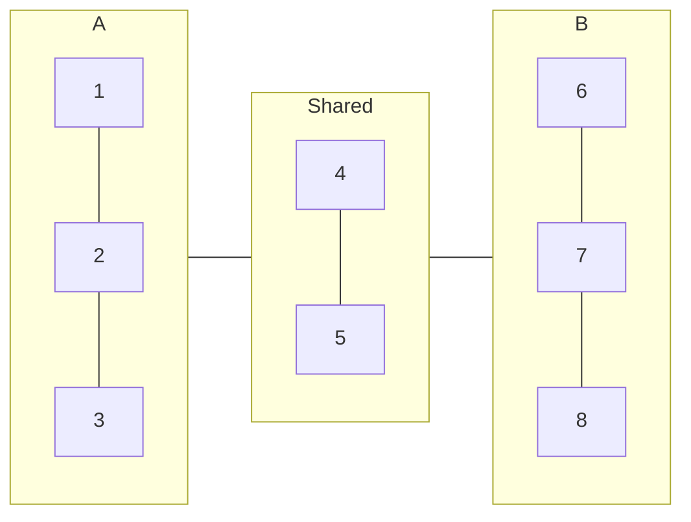
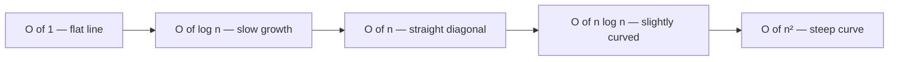

A **data structure** is a way of organising data so a program can use it efficiently. Choosing the wrong structure for a problem is one of the most common causes of slow, buggy software. This lesson covers the three most important built-in structures in Python and introduces the intuition behind algorithmic efficiency.

## Lists

A list is an **ordered, mutable** sequence of values. Items stay in the order you put them and can be changed after creation.

```python
fruits = ["apple", "banana", "cherry", "date"]

print(fruits[0])       
print(fruits[-1])      
print(fruits[1:3])     
```

Indexing starts at 0. Negative indices count from the end. Slicing `[start:stop]` returns a new list from `start` up to but not including `stop`.

### Mutating a List

```python
fruits.append("elderberry")     
fruits.insert(1, "avocado")     
fruits.remove("banana")         
popped = fruits.pop()           
fruits.sort()                   
```

### Iterating

```python
for fruit in fruits:
    print(fruit.upper())

scores = [88, 74, 95, 61, 82]
total = sum(scores)
mean  = total / len(scores)
above_mean = [s for s in scores if s > mean]
print(above_mean)
```

The last line is a **list comprehension** — a concise way to build a filtered or transformed list in a single expression.

<details class="collapsible">
<summary>List comprehensions in depth</summary>
<div class="details-body">

The pattern is `[expression for item in iterable if condition]`. The `if` part is optional.

```python
numbers = range(1, 11)

squares      = [n ** 2 for n in numbers]
even_squares = [n ** 2 for n in numbers if n % 2 == 0]
words        = ["hello", "world", "python"]
upper_words  = [w.upper() for w in words]

print(squares)       
print(even_squares)  
print(upper_words)   
```

List comprehensions are faster than equivalent `for` loops for most simple transformations because they are optimised at the interpreter level.

</div>
</details>

## Dictionaries

A dictionary is an **unordered** collection of **key-value pairs**. Keys must be unique and immutable (strings, numbers, or tuples). Values can be anything.

```python
student = {
    "name":   "Aisha Malik",
    "grade":  10,
    "scores": [88, 92, 79],
    "active": True,
}

print(student["name"])          
print(student.get("age", 0))    

student["grade"] = 11           
student["city"]  = "Nairobi"    

for key, value in student.items():
    print(f"{key}: {value}")
```

`dict.get(key, default)` is safer than `dict[key]` — it returns the default instead of raising a `KeyError` when the key does not exist.

### When to Use a Dictionary

Dictionaries give you **O(1) average lookup** — finding a value by key takes the same time whether the dictionary has 10 items or 10 million. Lists require scanning from the beginning, giving O(n) lookup.

```python
banned_words = {"spam", "scam", "phish"}
message = "click here for free money scam"

words = message.split()
flagged = [w for w in words if w in banned_words]
print(flagged)
```

`in banned_words` on a **set** (covered below) is O(1). The same check on a list would be O(n).

<details class="collapsible">
<summary>Nested dictionaries — modelling real data</summary>
<div class="details-body">

Dictionaries can be nested to model structured data like a database row or a JSON API response.

```python
classroom = {
    "room":     "B204",
    "teacher":  "Ms Okonkwo",
    "students": {
        "S001": {"name": "Aisha",  "grade": 10, "gpa": 3.8},
        "S002": {"name": "Marcus", "grade": 10, "gpa": 3.5},
        "S003": {"name": "Lin",    "grade": 11, "gpa": 3.9},
    }
}

for sid, info in classroom["students"].items():
    print(f"{sid}: {info['name']} — GPA {info['gpa']}")

top_student = max(
    classroom["students"].values(),
    key=lambda s: s["gpa"]
)
print(f"Top student: {top_student['name']}")
```

</div>
</details>

## Sets

A set is an **unordered collection of unique values**. Duplicates are automatically discarded. Sets are optimised for membership testing and mathematical set operations.

```python
a = {1, 2, 3, 4, 5}
b = {4, 5, 6, 7, 8}

print(a | b)    
print(a & b)    
print(a - b)    
print(a ^ b)    
```



### Deduplication Pattern

```python
raw_tags = ["python", "data", "python", "science", "data", "ml"]
unique_tags = list(set(raw_tags))
print(unique_tags)
```

Converting to a set and back to a list removes every duplicate in O(n) time — far faster than manually checking for duplicates with nested loops.

## Big O — Measuring Efficiency

**Big O notation** describes how an algorithm's runtime grows as input size grows. It gives us a language to compare approaches without running benchmarks.

| Notation | Name | Example operation |
|----------|------|-------------------|
| O(1) | Constant | Dict/set lookup, list index |
| O(log n) | Logarithmic | Binary search |
| O(n) | Linear | Scanning a list |
| O(n log n) | Linearithmic | Python's `list.sort()` |
| O(n²) | Quadratic | Nested loops over same list |



```python
items = list(range(10_000))

def linear_search(lst, target):
    for item in lst:           
        if item == target:
            return True
    return False

def constant_lookup(s, target):
    return target in s         

items_set = set(items)
print(linear_search(items, 9999))   
print(constant_lookup(items_set, 9999))
```

Both return the same answer. For 10,000 items the difference is small. For 10,000,000 items, it is the difference between milliseconds and minutes.

## Choosing the Right Structure

<details class="collapsible">
<summary>Decision guide</summary>
<div class="details-body">

Ask these questions in order:

1. **Do I need to look things up by a name or ID?** → Dictionary
2. **Do I only need to know if something exists, or do set operations?** → Set
3. **Do I need order, duplicates, or indexed access?** → List
4. **Do I need immutable, hashable sequence?** → Tuple

Wrong choice examples:
- Storing 1 million usernames in a list and checking `if username in users` — O(n) per check, use a set instead
- Storing student records in a list of lists — painful to access, use a list of dicts or a dict of dicts
- Using a dict when you just need uniqueness — use a set, it is clearer and slightly faster

</div>
</details>

## Check Your Understanding

<div class="hint-chain">
  <div class="hint-item">
    <button class="hint-trigger" aria-expanded="false">💡 What is the difference between a list and a set?</button>
    <div class="hint-body">A list is ordered, allows duplicates, and supports indexing. A set is unordered, stores only unique values, and supports fast membership testing and set operations (union, intersection, difference).</div>
  </div>
  <div class="hint-item">
    <button class="hint-trigger" aria-expanded="false">💡 Why is dict/set lookup O(1) but list search O(n)?</button>
    <div class="hint-body">Dicts and sets use a hash table internally. A hash function converts a key into an array index directly, so lookup is a single step regardless of size. A list search must check each element sequentially until it finds a match.</div>
  </div>
  <div class="hint-item">
    <button class="hint-trigger" aria-expanded="false">💡 Write a list comprehension that produces the squares of all odd numbers from 1 to 20.</button>
    <div class="hint-body">

```python
odd_squares = [n ** 2 for n in range(1, 21) if n % 2 != 0]
print(odd_squares)
```

</div>
  </div>
  <div class="hint-item">
    <button class="hint-trigger" aria-expanded="false">💡 Given two lists of student IDs, how would you find the IDs that appear in both?</button>
    <div class="hint-body">

```python
class_a = [101, 102, 103, 104, 105]
class_b = [103, 104, 105, 106, 107]
both = list(set(class_a) & set(class_b))
print(both)
```

Converting to sets gives O(n) total time. A nested loop approach would be O(n²).
    </div>
  </div>
</div>

## Going Further

- Implement a word-frequency counter using a dictionary: read a string, split it into words, and count how many times each word appears
- Benchmark `linear_search` vs set lookup using Python's `timeit` module for input sizes of 100, 10,000, and 1,000,000
- Research **stacks** and **queues** — data structures built on top of lists with restricted access patterns
- Explore `collections.defaultdict` and `collections.Counter` in the Python standard library
