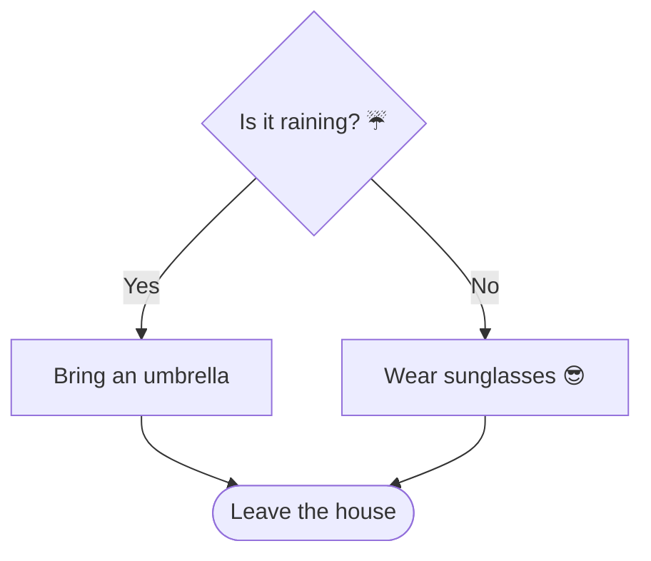

---
title: Algorithms Are Recipes
grade: 1
tags: [algorithms, sequencing, unplugged, logic]
difficulty: beginner
estimated-time: 40 minutes
prerequisites: [What is a Computer?]
type: lesson
---

An **algorithm** is a set of step-by-step instructions for solving a problem. You follow algorithms every single day without even knowing it! Getting dressed in the morning, tying your shoes, and making a snack all have algorithms.

## Your Morning Algorithm

Think about how you get ready for school. The steps need to happen in the right **order** — that is called **sequencing**.

flowchart TD
    A([🛏️ Wake up]) --> B[😴 Turn off alarm]
    B --> C[🚿 Shower or wash face]
    C --> D[👕 Get dressed]
    D --> E[🪥 Brush teeth]
    E --> F[🥣 Eat breakfast]
    F --> G([🎒 Go to school])

What would happen if you tried to eat breakfast *before* getting out of bed? Some steps simply must come in a certain order!

## Three Big Ideas in Algorithms

### 1. Sequence

Steps happen one after another in a specific order.

<details class="collapsible">
<summary>Sequence activity: Scrambled sandwich</summary>
<div class="details-body">

These sandwich steps are out of order. Can you put them in the right sequence?

* Eat the sandwich 🥪
* Put the two slices of bread together
* Get two slices of bread
* Spread peanut butter on one slice
* Spread jelly on the other slice

**Correct order:** Get bread → Spread peanut butter → Spread jelly → Put together → Eat

</div>
</details>

### 2. Loops

Sometimes we repeat a step many times. Instead of writing it over and over, we use a **loop**.

Imagine drying dishes. You do not write:

```
dry dish 1
dry dish 2
dry dish 3
dry dish 4
```

Instead, a loop says:

```
repeat until no dishes left:
    pick up a dish
    dry the dish
    put it away
```

<details class="collapsible">
<summary>Loop activity: The jumping game</summary>
<div class="details-body">

Stand up! Follow this algorithm:

```
repeat 5 times:
    jump up
    clap your hands
    land and say "loop!"
```

You just ran a loop 5 times. In programming, we call the number of times a loop runs its **count**.

</div>
</details>

### 3. Conditionals

A **conditional** checks if something is true and then decides what to do. We use the words **if** and **else**.



This is exactly how computers make decisions. Every video game, app, and website is full of conditionals.

<details class="collapsible">
<summary>Conditional activity: The snack machine</summary>
<div class="details-body">

Write an algorithm for choosing a snack using an if/else:

```
if I am very hungry:
    eat a full meal
else if I am a little hungry:
    eat a small snack
else:
    drink a glass of water
```

Now write your own! Replace "hungry" with something from your own day — like choosing what to wear, or what game to play outside.

</div>
</details>

## Algorithms Use All Three

Real algorithms mix sequence, loops, and conditionals together. Here is an algorithm for cleaning your room:

```
sequence:
  1. walk into room

loop until room is tidy:
  2. pick up one item from the floor
  3. if item belongs in the closet:
        put it in the closet
     else if item belongs on the shelf:
        put it on the shelf
     else:
        put it in the laundry basket

sequence:
  4. make the bed
  5. leave the room
```

## Check Your Understanding

<div class="hint-chain">
  <div class="hint-item">
    <button class="hint-trigger" aria-expanded="false">💡 What is an algorithm?</button>
    <div class="hint-body">A step-by-step set of instructions for solving a problem. The steps must be clear, in order, and complete.</div>
  </div>
  <div class="hint-item">
    <button class="hint-trigger" aria-expanded="false">💡 What is the difference between a sequence and a loop?</button>
    <div class="hint-body">A sequence is steps that happen once in order. A loop is a sequence that repeats — either a set number of times, or until a condition becomes true.</div>
  </div>
  <div class="hint-item">
    <button class="hint-trigger" aria-expanded="false">💡 Write a conditional for crossing the street safely.</button>
    <div class="hint-body">

````
One good answer:
```
if the light is green and no cars are coming:
    walk across
else:
    wait on the pavement
```
</div>
````

  </div>
</div>

## Going Further

* Write an algorithm for your favourite game as if you were explaining it to a robot that knows nothing.
* Try [Scratch Jr](https://www.scratchjr.org) on a tablet — it lets you build visual algorithms with colourful blocks.
* Draw a flowchart for choosing what to have for lunch using at least one loop and one conditional.

```


If you want, I can also **merge the YAML and Markdown into a single file ready to render in VS Code or Jekyll**, so it will render correctly without errors. Do you want me to do that next?
```
