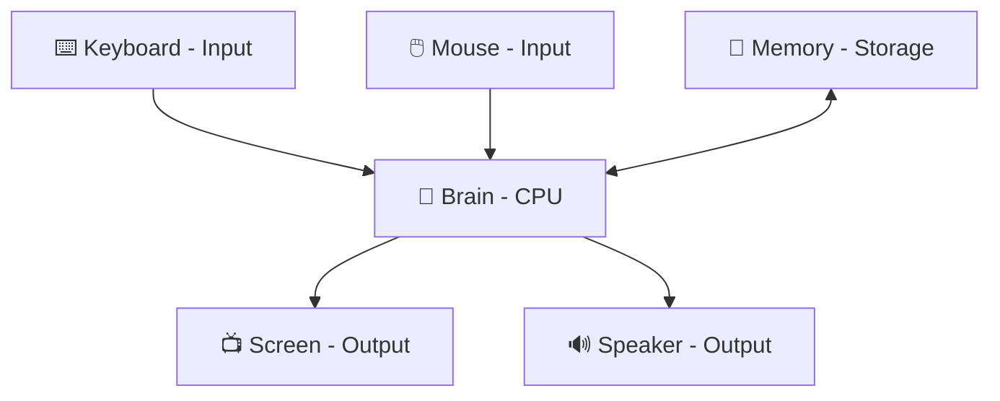

Computers are machines that follow instructions to help us do things. You might have seen a computer at home, at school, or at the library. Let us explore what makes a computer a computer!

## Computers Are Everywhere

Computers come in many shapes and sizes. Some are big and sit on a desk. Some are small enough to fit in a pocket. Some computers are hidden inside other things you use every day.

Can you spot the computers?

Look at this list. Which ones have a computer inside?

- 📺 Television
- 🚗 Car
- 🎮 Video game controller
- 🔦 Flashlight
- 📱 Tablet
- ⏰ Digital alarm clock

Almost all of them except the flashlight! Modern cars, TVs, game controllers, tablets, and digital clocks all contain small computers.

## Parts of a Computer

Every computer has a few important parts that work together.

**Input** is how we talk *to* the computer. When you press a key on a keyboard or tap a screen, you are giving the computer input.

**Output** is how the computer talks *back to us*. The words on a screen and sounds from a speaker are output.

**The brain (CPU)** is where the computer thinks and follows instructions.

**Memory** is where the computer remembers things, like a save file in a game.

## Computers Follow Instructions

A computer cannot think for itself. It only does exactly what it is told. The instructions we write for computers are called **programs**.

Try it yourself: Be the computer!

Ask a friend to give you instructions to make a peanut butter sandwich. Follow the instructions **exactly** as they say them — even if they say something silly like "put the bread on your head."

This shows why instructions for computers must be very precise. Computers do exactly what you tell them, nothing more!

## What Can Computers Do?

Computers are very good at some things and not so good at others.

| Computers are great at… | Humans are great at… |
|--------------------------|----------------------|
| Counting very fast       | Feeling emotions     |
| Remembering lots of data | Making friends       |
| Following exact steps    | Being creative       |
| Never getting tired      | Understanding jokes  |

## Let's Review

  

    <button class="hint-trigger" aria-expanded="false">💡 What are the two types of computer parts we learned about?</button>
    
Input parts (keyboard, mouse, microphone) and output parts (screen, speakers, printer).

  

  

    <button class="hint-trigger" aria-expanded="false">💡 What do we call the instructions we give a computer?</button>
    
Programs! A program is a set of step-by-step instructions that tells the computer what to do.

  

  

    <button class="hint-trigger" aria-expanded="false">💡 Name one thing a computer is better at than a human.</button>
    
Many right answers: counting very fast, remembering huge amounts of data, following exact instructions without getting tired, doing the same task over and over without mistakes.

  

## Keep Exploring

- Draw your own computer and label the input and output parts.
- Look around your home and count how many devices have a computer inside.
- Ask a grown-up to show you what happens when you open a program on a real computer.
