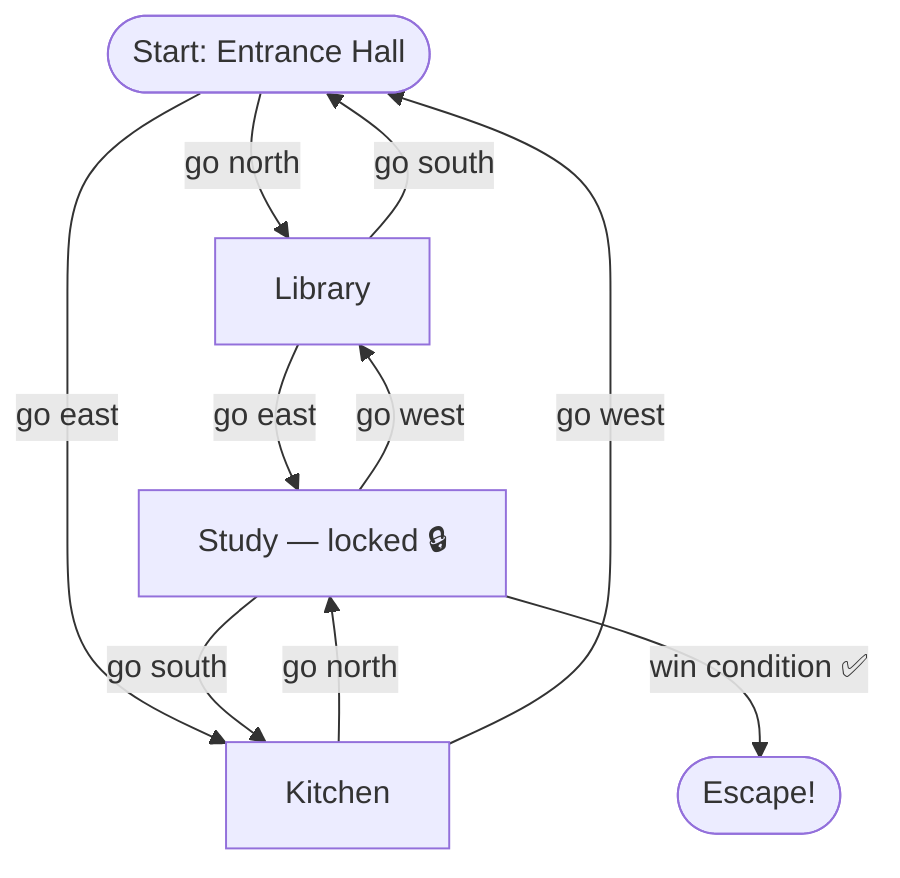

You will build a text-based adventure game engine in Python. The player navigates between rooms, picks up items, solves puzzles, and reaches a win condition — all driven by dictionary-based data structures and a game loop. By the end you will have a fully playable game that runs in the terminal.

## What You Will Build



The player starts in the Entrance Hall, explores connected rooms, finds a key in the Kitchen, uses it to unlock the Study, and escapes.

## Project Structure

```
text-adventure/
├── engine.py      ← game loop, command parser
├── world.py       ← room and item definitions
└── main.py        ← entry point
```

## Starter Code

### `world.py` — Define the World

```python
ROOMS = {
    "entrance": {
        "name":        "Entrance Hall",
        "description": "A grand hallway with dusty portraits on the walls. Doors lead north and east.",
        "exits":       {"north": "library", "east": "kitchen"},
        "items":       [],
        "locked":      False,
    },
    "library": {
        "name":        "Library",
        "description": "Floor-to-ceiling bookshelves. A faint smell of old paper. Exits south and east.",
        "exits":       {"south": "entrance", "east": "study"},
        "items":       ["old map"],
        "locked":      False,
    },
    "kitchen": {
        "name":        "Kitchen",
        "description": "A cold stone kitchen. Something glints on the counter. Exits west and north.",
        "exits":       {"west": "entrance", "north": "study"},
        "items":       ["brass key"],
        "locked":      False,
    },
    "study": {
        "name":        "Study",
        "description": "A small, dim study. A trapdoor in the floor leads to freedom.",
        "exits":       {"west": "library", "south": "kitchen"},
        "items":       ["journal"],
        "locked":      True,
        "unlock_item": "brass key",
        "win_room":    True,
    },
}

ITEMS = {
    "brass key": {
        "description": "A tarnished brass key with a tag reading 'Study'.",
        "takeable":    True,
    },
    "old map":   {
        "description": "A hand-drawn map of the house. It marks the study as the exit.",
        "takeable":    True,
    },
    "journal":   {
        "description": "A leather journal. The last entry reads: 'The trapdoor is the only way out.'",
        "takeable":    True,
    },
}

INITIAL_STATE = {
    "current_room": "entrance",
    "inventory":    [],
    "moves":        0,
    "won":          False,
}
```

### `engine.py` — Game Logic

```python
from world import ROOMS, ITEMS, INITIAL_STATE
import copy

def describe_room(state):
    room = ROOMS[state["current_room"]]
    print(f"\n{'=' * 50}")
    print(f"  {room['name']}")
    print(f"{'=' * 50}")
    print(room["description"])

    if room["items"]:
        items_str = ", ".join(room["items"])
        print(f"\nYou see: {items_str}")

    exits_str = ", ".join(room["exits"].keys())
    print(f"Exits: {exits_str}")
    print(f"Inventory: {state['inventory'] or 'nothing'}")

def handle_go(state, direction):
    room = ROOMS[state["current_room"]]

    if direction not in room["exits"]:
        print("You can't go that way.")
        return state

    destination_key = room["exits"][direction]
    destination     = ROOMS[destination_key]

    if destination["locked"]:
        required = destination.get("unlock_item")
        if required and required in state["inventory"]:
            destination["locked"] = False
            state["inventory"].remove(required)
            print(f"You use the {required} to unlock the {destination['name']}.")
        else:
            needed = destination.get("unlock_item", "a key")
            print(f"The {destination['name']} is locked. You need {needed}.")
            return state

    state["current_room"] = destination_key
    state["moves"] += 1

    if destination.get("win_room"):
        describe_room(state)
        print("\n🎉 You found the trapdoor and escaped! Congratulations!")
        print(f"   Completed in {state['moves']} moves.")
        state["won"] = True

    return state

def handle_take(state, item_name):
    room = ROOMS[state["current_room"]]

    if item_name not in room["items"]:
        print(f"There is no '{item_name}' here.")
        return state

    item = ITEMS.get(item_name, {})
    if not item.get("takeable", False):
        print(f"You can't take the {item_name}.")
        return state

    room["items"].remove(item_name)
    state["inventory"].append(item_name)
    print(f"You pick up the {item_name}.")
    return state

def handle_examine(state, target):
    room = ROOMS[state["current_room"]]

    if target in room["items"] or target in state["inventory"]:
        item = ITEMS.get(target)
        if item:
            print(item["description"])
        else:
            print(f"You see nothing special about the {target}.")
    else:
        print(f"There is no '{target}' here.")

def parse_command(raw):
    parts = raw.strip().lower().split(None, 1)
    verb  = parts[0] if parts else ""
    noun  = parts[1] if len(parts) > 1 else ""
    return verb, noun

def run():
    state = copy.deepcopy(INITIAL_STATE)
    print("=" * 50)
    print("  THE LOCKED HOUSE")
    print("  Type 'help' for commands")
    print("=" * 50)
    describe_room(state)

    while not state["won"]:
        try:
            raw = input("\n> ").strip()
        except (EOFError, KeyboardInterrupt):
            print("\nFarewell.")
            break

        if not raw:
            continue

        verb, noun = parse_command(raw)

        if verb in ("go", "move", "walk"):
            state = handle_go(state, noun)
            if not state["won"]:
                describe_room(state)

        elif verb in ("take", "pick", "grab"):
            state = handle_take(state, noun)

        elif verb in ("examine", "look", "inspect", "x"):
            handle_examine(state, noun)

        elif verb in ("inventory", "i", "bag"):
            if state["inventory"]:
                print("Carrying: " + ", ".join(state["inventory"]))
            else:
                print("You are carrying nothing.")

        elif verb in ("help", "?", "h"):
            print("Commands: go [direction], take [item], examine [item], inventory, quit")

        elif verb in ("quit", "exit", "q"):
            print("Farewell.")
            break

        else:
            print("Unknown command. Type 'help' for a list of commands.")
```

### `main.py` — Entry Point

```python
from engine import run

if __name__ == "__main__":
    run()
```

## Running the Game

```bash
cd text-adventure
python main.py
```

Sample session:

```
> go north
You enter the Library.
You see: old map
Exits: south, east

> take old map
You pick up the old map.

> examine old map
A hand-drawn map of the house. It marks the study as the exit.

> go east
The Study is locked. You need brass key.

> go south
...
```

## Extension Challenges

<details class="collapsible">
<summary>Challenge 1 — Add a health system</summary>
<div class="details-body">

Add a `health` key to `INITIAL_STATE` starting at 100. Add a `hazard` field to some rooms that reduces health by a set amount when the player enters. Print a warning when health drops below 30. End the game with a loss message if health reaches 0.

```python
INITIAL_STATE = {
    "current_room": "entrance",
    "inventory":    [],
    "moves":        0,
    "won":          False,
    "health":       100,
}
```

In `handle_go`, after moving:
```python
hazard = destination.get("hazard", 0)
if hazard:
    state["health"] -= hazard
    print(f"Ouch! You took {hazard} damage. Health: {state['health']}")
    if state["health"] <= 0:
        print("You collapse. Game over.")
        state["won"] = True
```

</div>
</details>

<details class="collapsible">
<summary>Challenge 2 — Save and load game state</summary>
<div class="details-body">

Use Python's `json` module to serialise and deserialise the state dictionary.

```python
import json

def save_game(state, filename="save.json"):
    with open(filename, "w") as f:
        json.dump(state, f, indent=2)
    print("Game saved.")

def load_game(filename="save.json"):
    try:
        with open(filename) as f:
            return json.load(f)
    except FileNotFoundError:
        print("No save file found.")
        return None
```

Add `save` and `load` as commands in the `run()` parser.

</div>
</details>

<details class="collapsible">
<summary>Challenge 3 — NPC dialogue system</summary>
<div class="details-body">

Add an `npc` field to rooms. When the player types `talk`, display the NPC's lines and update a flag in state so dialogue advances each time.

```python
"library": {
    ...
    "npc": {
        "name":   "Ghost Librarian",
        "lines":  [
            "Who disturbs my library?",
            "The key you seek is in the kitchen.",
            "Find the key... and leave me in peace.",
        ],
        "line_index": 0,
    },
}
```

</div>
</details>

## Solution

<details class="collapsible">
<summary>Full working solution (spoiler — try it yourself first!)</summary>
<div class="details-body">

The starter code above **is** the complete solution. Every function is fully implemented and the game is playable as written. The project goal is to understand how the pieces connect, then extend it with the challenges above.

Key design decisions worth studying:
- `state` is a plain dictionary passed through every function — no global variables
- `ROOMS` is mutated in place when a room is unlocked (`destination["locked"] = False`) — a deliberate simplification; a production engine would store lock state in `state` instead
- `copy.deepcopy(INITIAL_STATE)` ensures each new game starts from a clean slate even if `ROOMS` was mutated in a previous run
- `parse_command` splits on the first whitespace only (`split(None, 1)`) so item names with spaces like `"brass key"` are preserved in the noun

</div>
</details>
